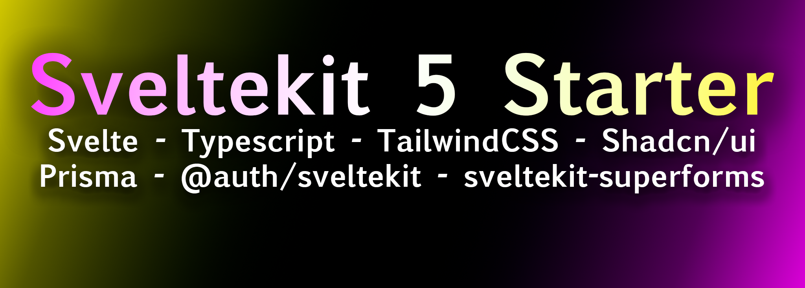

<a href="https://github.com/timscodebase/Svelte-5-Starter/tree/main">

</a>
<p align="center">
  <a href="#-features"><strong>Features</strong></a> ·
  <a href="#-deployment"><strong>Deployment</strong></a> ·
  <a href="#-getting-started"><strong>Getting started</strong></a> ·
  <a href="#%EF%B8%8F-scripts-overview"><strong>Scripts overview</strong></a> ·
  <a href="#-contribution"><strong>Contribution</strong></a> ·
  <a href="#%EF%B8%8F-support"><strong>Support</strong></a>
</p>

# Svelte 5 Starter

This is a simple starter template for Svelte 5. It includes a basic setup for a Svelte 5 project with a simple component and a simple store. The template alo features TailwindCSS for styling.

## Features

- 🚀 Sveltekit (beta version 5)
- 📘 Typescript
- 🎨 TailwindCSS - Class sorting, merging and linting
- 🛠️ Shadcn/ui - Customizable UI components
- 🔒 @auth/sveltekit - Easy authentication library for Next.js (GitHub provider)
- 🛡️ Prisma - ORM for node.js
- 📋 sveltekit-superforms - Manage your forms easy and efficient
- 🔍 Zod - Schema validation library
- 🧪 Jest & React Testing Library - Configured for unit testing
- 🎭 Playwright - Configured for e2e testing
  📈 Absolute Import & Path Alias - Import components using @/ prefix
- 💅 Prettier - Code formatter
- 🧹 Eslint - Code linting tool
- 🐶 Husky & Lint Staged - Run scripts on your staged files before they are committed
- 🔹 Icons - From Lucide
- 🌑 Dark mode - With next-themes
- 🗺️ Sitemap & robots.txt - With next-sitemap
- 📝 Commitlint - Lint your git commits
- 🤖 Github actions - Lint your code on PR
- ⚙️ T3-env - Manage your environment variables
- 💯 Perfect Lighthouse score

## 🚀 Deployment

Easily deploy your Sveltekit app with <a href="https://vercel.com/">Vercel</a> by clicking the button below:

[](https://github.com/timscodebase/Svelte-5-Starter.git)

## 🎯 Getting started

### 1. Clone this template in one of three ways

1. Using this repository as template

   

2. Using `git clone`

   ```bash
   git clone https://github.com/timscodebase/Svelte-5-Starter.git my-project-name
   ```

### 2. Install dependencies

```bash
pnpm install
```

### 3. Set up environment variables

Create `.env` file and set env variables from `.env.example` file.

### 4. Prepare husky

It is required if you want husky to work

```bash
pnpm run prepare
```

### 5. Run the dev server

You can start the server using this command:

```bash
pnpm run dev
```

## ⚙️ Scripts overview

The following scripts are available in the `package.json`:

- `dev`: Run development server
- `build`: Build the app
- `start`: Run production server
- `preview`: Run `build` and `start` commands together
- `lint`: Lint the code using Eslint
- `lint:fix`: Fix linting errors
- `format:check`: Checks the code for proper formatting
- `format:write`: Fix formatting issues
- `typecheck`: Type-check TypeScript without emitting files
- `test`: Run unit tests
- `test:watch`: Run unit tests in watch mode
- `e2e`: Run end-to-end tests
- `e2e:ui`: Run end-to-end tests with UI
- `postbuild`: Generate sitemap
- `prepare`: Install Husky for managing Git hooks

## 🤝 Contribution

To contribute, please follow these steps:

1. Fork the repository.
2. Create a new branch.
3. Make your changes, and commit them.
4. Push your changes to the forked repository.
5. Create a pull request.

## ❤️ Support

If you liked the project, I will appreciate if you leave a star. 🌟😊

Made by <a href="https://timsmith.tech">Tim Smith</a>
